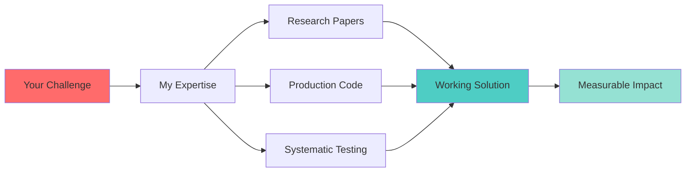

<div align="center">

# 👋 Hey, I'm Aditya Vikram


</div>

<div align="center">
  
[](https://linkedin.com/in/avikram553)
[](https://aditya-portfolio-frontend-u4je.onrender.com/)
[](mailto:vkrm.aditya553@gmail.com)
[](https://github.com/avikram553)


</div>

---

## 🎯 About Me

```python
class AdityaVikram:
    def __init__(self):
        self.role = "AI Engineer & LLM Developer"
        self.location = "Germany 🇩🇪"
        self.education = "Master's @ TU Chemnitz | Web Engineering"
        self.experience = "3.7 years @ Bosch | Production AI Systems"
        self.passion = "Turning research papers into production code"
        
    def expertise(self):
        return {
            "LLMs": ["GPT-4", "Claude", "Llama 3.1", "Qwen", "Gemini"],
            "Frameworks": ["LangChain", "PyTorch", "TensorFlow", "Hugging Face"],
            "Specialties": ["RAG Systems", "Prompt Engineering", "AI Evaluation"],
            "Cloud": ["AWS", "Azure", "Serverless Architecture"],
            "Languages": ["Python", "JavaScript", "C++", "SQL"]
        }
    
    def current_focus(self):
        return "Building trustworthy AI through systematic testing & evaluation"
    def career_goal(self):
        return "Transitioning from automotive to pure software/tech companies"
```

<div align="center">

### 🚀 Currently

🔬 Researching **Semantic AI with Llama 3.1** (87% accuracy achieved)  
🎓 Master's student at **TU Chemnitz**  
💼 Available for **AI/ML roles** & **collaborations**  
🌟 **Star Performer** for **12 consecutive quarters** at Bosch

</div>

---

## 💼 What I Bring to Your Team

<table>
<tr>
<td width="50%">

### 🎯 Production AI Expertise
- ✅ Built LLM apps serving **10,000+ users**
- ✅ Achieved **92% accuracy** in ML models
- ✅ Reduced latency by **40%** through optimization
- ✅ **99.9% uptime** in production systems

</td>
<td width="50%">

### 🔬 Research-to-Production
- ✅ Translate papers into working code
- ✅ Rapid prototyping & validation
- ✅ Systematic evaluation frameworks
- ✅ Evidence-based optimization

</td>
</tr>
</table>

<table>
<tr>
<td width="50%">

### 🌐 Full-Stack AI Development
- ✅ Python backend (FastAPI, Flask)
- ✅ React frontend development
- ✅ Cloud deployment (AWS, Azure)
- ✅ End-to-end lifecycle management

</td>
<td width="50%">

### 🤝 Global Collaboration
- ✅ Worked across **China, Japan, Germany**
- ✅ Cross-functional team leadership
- ✅ Clear technical communication
- ✅ Agile & stakeholder management

</td>
</tr>
</table>

---

## 🛠️ Tech Arsenal

<div align="center">

### AI & Machine Learning


### Development & Cloud


### LLM & GenAI


</div>

---

## 🚀 Featured Projects

<table>
<tr>
<td width="50%">

### 🤖 [AI Portfolio Assistant](https://aditya-portfolio-frontend-u4je.onrender.com/)


**Production conversational AI with Qwen LLM**

🎯 End-to-end development from concept to deployment  
🧠 Context-aware responses with RAG  
📊 A/B testing for optimization  
⚡ Real-time evaluation metrics

**Tech:** Qwen, LangChain, FastAPI, React, AWS

[🔗 Live Demo](https://aditya-portfolio-frontend-u4je.onrender.com/) | [💻 Code](#)

</td>
<td width="50%">

### 💬 [MCP Sentiment Analysis](https://github.com/avikram553/MCP_Sentiment_Analysis_HuggingFace-)


**AI-powered sentiment analysis with MCP**

🎯 Real-time polarity & subjectivity scoring  
🔧 Model Context Protocol integration  
📦 Docker containerization  
✅ Production-ready evaluation framework

**Tech:** Python, TextBlob, Gradio, MCP

[💻 GitHub](https://github.com/avikram553/MCP_Sentiment_Analysis_HuggingFace-)

</td>
</tr>
</table>

<table>
<tr>
<td width="50%">

### 📄 [Research Paper Summarizer](https://github.com/avikram553/Research-Paper-Summariser)


**RAG-powered document intelligence**

🎯 60% reduction in literature review time  
🔍 Semantic chunking & vector search  
📊 ROUGE scores & similarity metrics  
🧪 Automated evaluation pipeline

**Tech:** LangChain, Hugging Face, Python

[💻 GitHub](https://github.com/avikram553/Research-Paper-Summariser)

</td>
<td width="50%">

### 🔧 Predictive Maintenance ML


**Automotive diagnostic AI system**

🎯 92% accuracy in failure prediction  
⚡ 99.9% uptime in production  
🚗 Serving major OEM service centers  
🔐 Safety-critical validation

**Tech:** PyTorch, FastAPI, AWS, MLOps

</td>
</tr>
</table>

---

## 📊 GitHub Analytics

<div align="center">


</div>

---

## 🏆 Key Achievements

<div align="center">

| 🎯 Achievement | 📊 Impact |
|:---|---:|
| **Production LLM Systems** | 10,000+ users served |
| **ML Model Accuracy** | 92% in safety-critical systems |
| **Latency Optimization** | 40% reduction achieved |
| **System Uptime** | 99.9% reliability |
| **Star Performer** | 12 consecutive quarters |
| **Data Processing** | 50GB+ daily pipelines |
| **International Delivery** | China, Japan, Germany |
| **Research Accuracy** | 87% (Llama 3.1 semantic matching) |

</div>

---

## 🔬 Current Research

<div align="center">

### Semantic Attribute Matching with Llama 3.1 LLMs
*TU Chemnitz | 2025 - Present*

</div>

```
📌 Building production AI system for German Open Data portals
🎯 Achieved 87% accuracy through systematic evaluation
🔬 Focus: LLM testing frameworks, prompt engineering, statistical analysis
📊 Methods: Few-shot learning, evaluation metrics, robustness testing
```

---

## 💼 Professional Experience

<table>
<tr>
<td width="30%">


**2022 - 2025**

*Senior Software Engineer*
*AI/ML*

</td>
<td width="70%">

**Key Contributions:**
- 🎯 Architected LLM evaluation frameworks for 10,000+ users
- 🤖 Built RAG systems with LangChain processing 50GB+ daily
- ⚡ Optimized prompt engineering (40% latency reduction)
- 🌐 Led international AI projects (China, Japan, Germany)
- ☁️ Deployed serverless apps on AWS & Azure
- 🌟 Star Performer: 12 consecutive quarters

**Impact:** Delivered production AI solutions serving major automotive OEMs

</td>
</tr>
</table>

---

## 🎓 Education

<div align="center">

### 🎓 Technische Universität Chemnitz
**Master of Science in Web Engineering** | 2025 - Present

*Research Focus:* Semantic AI, LLM Applications, NLP, Cloud Systems

---

### 🎓 Netaji Subhash Engineering College
**Bachelor of Technology** | 2017 - 2021 | **GPA: 8.95/10**

*Electronics & Communications Engineering*

</div>

---

## 🌍 Languages & Communication

<div align="center">

| Language | Proficiency | Level |
|:---:|:---:|:---:|
| 🇮🇳 **Hindi** | Native | C2 |
| 🇬🇧 **English** | Fluent | C1 |
| 🇩🇪 **German** | Learning | A2 |

</div>

---

## 💡 Why Work With Me?

<div align="center">



</div>

### 🎯 I Excel At:

- 🔬 **Research-to-Production**: Translating cutting-edge papers into deployed systems
- 🤖 **LLM Engineering**: Building, evaluating, and optimizing GenAI applications
- 📊 **Data-Driven**: Evidence-based decisions with systematic evaluation
- 🌐 **Full-Stack AI**: Backend APIs, frontend UIs, cloud deployment
- 🤝 **Collaboration**: Clear communication across technical and business teams
- ⚡ **Fast Execution**: Rapid prototyping, iterative development, quick delivery

---

## 🎯 Services I Offer

<table>
<tr>
<td width="33%" align="center">

### 🤖 AI/ML Development
Build production LLM applications, RAG systems, and AI agents

</td>
<td width="33%" align="center">

### 🔬 Research & Consulting
Evaluate AI systems, optimize prompts, design test frameworks

</td>
<td width="33%" align="center">

### 🚀 Full-Stack Solutions
End-to-end development from concept to deployment

</td>
</tr>
</table>

---

## 📞 Let's Build Something Amazing

<div align="center">

### 💼 Open to Opportunities

🤖 **AI/ML Engineering** | 🔬 **Research Collaborations** | 🚀 **Consulting Projects**

---

<a href="https://linkedin.com/in/avikram553" target="_blank">
  
</a>
<a href="mailto:vkrm.aditya553@gmail.com" target="_blank">
  
</a>
<a href="https://aditya-portfolio-frontend-u4je.onrender.com/" target="_blank">
  
</a>

---

### ⏰ Response Time: Within 24 hours

*I'm based in Germany (CET/CEST timezone)*

---


### 💭 "Building AI systems that bridge research and production"


</div>
